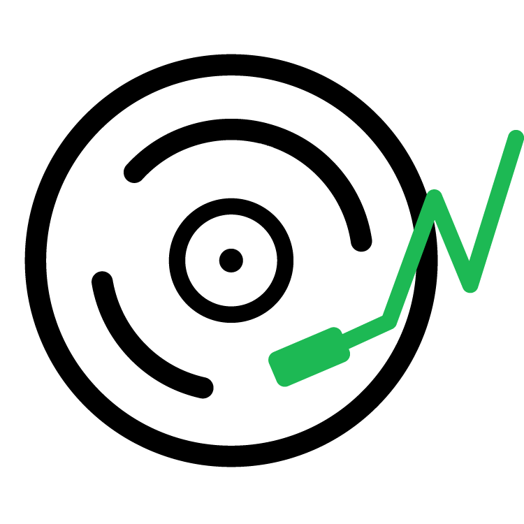

  

  <h3>StanStats</h3>
  
Spotify Monthly Listener Tracker

  <a href="https://buymeacoffee.com/mattbolanos">☕ Buy me a coffee</a> •
  <a href="https://github.com/mattbolanos/spotify-stream-app">🌟 Star on GitHub</a>

 
This is a hobby project, so I will try my best to fix bugs as they come up and add new features when I have time. Feel free to open an issue or submit a PR. If you have any questions about how I collect the Spotify data, feel free to DM me on <a href="https://twitter.com/mattbolanos">Twitter</a>.
